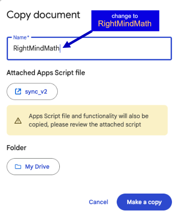

Step 1

Be sure you are logged into your Google Sheets account. Click the link below to open the Google Sheets main page. If you are prompted to log in, you will need to do that first, or create an account if you do not already have one.

<a target="_blank" href="https://docs.google.com/spreadsheets/d/1rvGuj6SkLtarqv6KIiZruUKnf3WAug2sIUIyRcpHBEM/edit?usp=sharing">Open Your Google Sheets Main Page</a>

Step 2 (optional)

Once you have reached your Google Sheets main page, you can close the window. In the next step you will open a copy of an existing Sheet named RightMindMath. It also opens in a new Google Sheets window, so have two open at the same time may be confusing.

Step 3

Click the link below to open the Google Sheet named <u>RightMindMath</u> in a separate window.

<a target="_blank" href="https://docs.google.com/spreadsheets/d/1rvGuj6SkLtarqv6KIiZruUKnf3WAug2sIUIyRcpHBEM/edit?usp=sharing">RightMindMath Google Sheet Link</a>

Step 4

Click the <u>File</u> menu button

Step 5

Select the <u>Make a copy</u> File menu option

Step 6

You will see the dialog below after clicking the link above. Change the text in the <u>Name</u> box to <b>RightMindMath</b> (delete the &#039;Copy of&#039; text). Leave everything else unchanged. Then click the green <u>Make a copy</u> button

