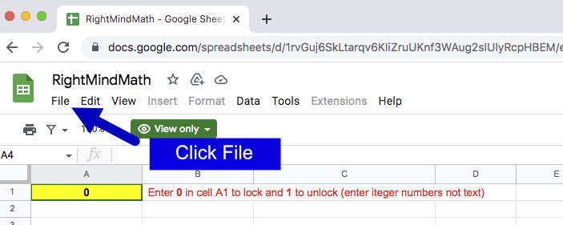

Step 1

Be sure you are logged into your Google Sheets account. Click the link below to open the Google Sheets main page. If you are prompted to log in, you will need to do that first, or create an account if you do not already have one.

<a target="_blank" href="https://docs.google.com/spreadsheets">Open Your Google Sheets Main Page</a>

Step 2 (optional)

Once you have reached your Google Sheets main page, you can close the window. In the next step you will open a copy of an existing Sheet named RightMindMath. It also opens in a new Google Sheets window, so have two open at the same time may be confusing.

Step 3

Click the link below to open the Google Sheet named <u>RightMindMath</u> in a separate window.

<a target="_blank" href="https://docs.google.com/spreadsheets/d/19njvzY6HNsjJ8juFMxCmaQrhc3dAvWqaqRJn1sm8-Gs/edit?usp=sharing">RightMindMath Google Sheet Link</a>

Step 4

Click the <u>File</u> menu button

Step 5

Select the <u>Make a copy</u> File menu option

Step 6

You will see the dialog below after clicking the link above. Change the text in the <u>Name</u> box to <b>RightMindMath</b> (delete the &#039;Copy of&#039; text). Leave everything else unchanged. Then click the green <u>Make a copy</u> button

Step 7

You now may want to verify that the API code is the copied sheet is unchanged when compared to the publicly reviewed code in the Github repository. This is a good safety check because the Github code is publicly available, and has a publicly available log of changes. The Google Sheet API could be changed by the sheet owner. Start by opening the link below in a separate Tab/Window. This W3 web page will compare two sets of texts. You will replace the text in each box with the Javascript code used by the Google Sheet.

<a target="_blank" href="https://www.w3docs.com/tools/code-diff/">Open W3 Code Diff Tool</a>

Step 8

Open the link below in a new Tab/Window. This is the publicly reviewed API code from Github. Click the "Raw" button above the text, and copy/paste all the text into the left wide of the W3 compare tool.

<a target="_blank" href="https://github.com/needMoreCoffeeNow/RightMindMath/blob/main/Google_Sheet_API/GSHEET_sync.js">Open Github Google Sheet API code</a>

Step 9

Goto the Tab/Window with the recently saved RightMindMath sheet (or open it if you closed that Tab/Window).

Click on the sheet&#039;s <u>Extensions</u> menu and select <u>Apps Script</u> option. This will open the Apps Script editor in a new tab. Note: The extensions load slowly after the sheet itself is open.  If the tab does not open, wait a minute and try again.

Step 10

Go to the Tab/Window with the W3 code diff tool, and paste the code from the Google Sheet API into the second (right) box replacing the text already in the box. After you paste this text, the W3 page will update and provide a long listing of the code comparison. Scroll through this listing. If any lines were changes, they will be highlighted. There should be no changes in the actual code. There may be an additional blank line or two. Differences in the number of blank lines can be ignored. If code has been changed, then look for another source for the Google Sheet. A trusted version should always be available at rightmindmath.com.

