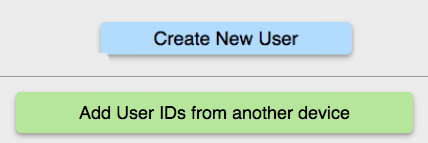

This topic does not have any steps. It is purely informational. However, you should read it. The Topics that follow require actions that will make a lot more sense if you read this.

The intent is to provide you a good understanding of how user IDs work across devices in RMM. Here is <b>an important TRUTH:</b> You can only set up a child (user) once.

The reason for this is that when you create a new user, RMM will assign a new, unique 9-digit ID (<b>Iduser</b>) for each new user added with the <u>Create New user</u> button (shown below).

If you try to create the same user (blue button) on another device YOU CANNOT DO IT. The 9-digit <b>Iduser</b> from the second setup will be different. Even if you use the exact same user name, the <b>Iduser</b> will be different.

RMM tracks everything your child does using the <b>Iduser</b>. When you add a user &amp; type in the user name, RMM creates a cross-reference between the <b>Iduser</b> &amp; the name. This allows RMM to show you the more meaningful (to you) user name in the user interface.

Also you will use the 9-digit <b>Iduser</b> as the title for the "ply" (new sheet) in your RightMindMath Google Sheet that stores all the sync data. Given this, using the same <b>Iduser</b> across multiple devices is critical.

There are two ways to setup a user on a device. The first creates the unique ID (<b>Iduser</b>). The second uses the original <b>Iduser</b> to create the same set of records on a second, third, etc. device.

Look at the two buttons in the image below. The first (blue) button is the create button. It will create  a unique 9-digit <b>Iduser</b>. The second (green &#151; all Sync buttons are green) lets you use the 9-digit <b>Iduser</b> from the create process to setup the same <b>Iduser</b> on other devices.

The addition of an existing user was put into the Sync process to make it 100% distinct to the process of creating a new user. Also it is likely you will grab the existing <b>Iduser</b> from your Sync Sheet, so it does make some sense to put it here.

The Topics that follow will walk you thru how to setup you child as a user. Hopefully given the info above you will be well informed about the process.

Create vs. Sync User Buttons

