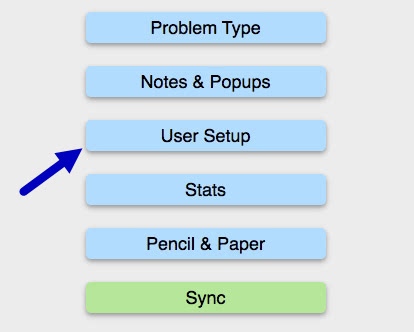
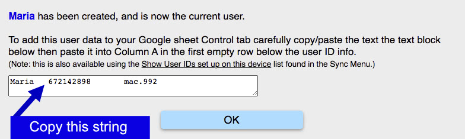
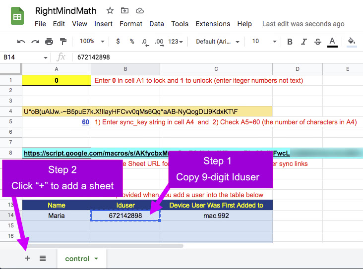
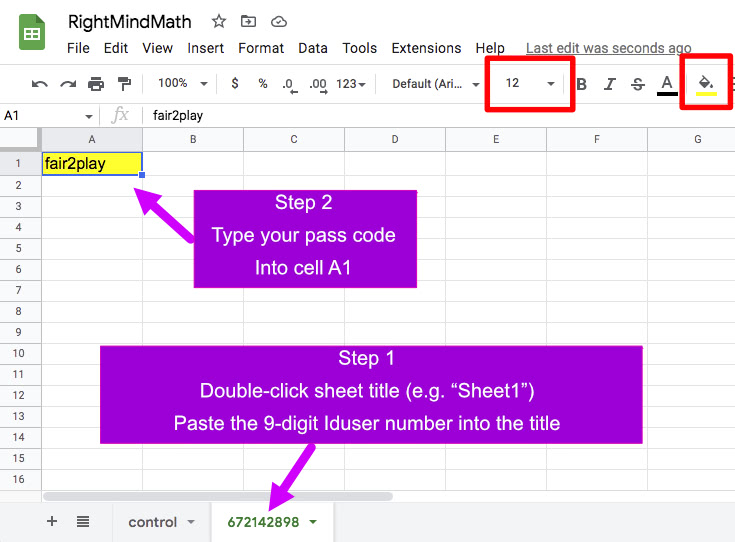

For the next step you must both RMM &amp; your RightMindMath sheet open at the same time.

Step 1

If RMM Settings are not shown, click the <u>Gear Icon</u> at the top-right of the screen to open Settings.

Click on the <u>User Setup</u> button.

Step 2

Click on the <u>Create New User</u> button in the User Setup menu.

Step 3

Type your user&#039; name or nick-name into the text box.

In this example <b>Maria</b> (she/her) is the name of the child.

Click the <u>Continue</u> button after you have entered the name.

Step 4

After you click <u>Continue</u> in the previous step you will see this dialog.

Before you click <u>OK</u> select all the text inside the text box.

Note: this text string is setup to paste as three separate cell values in the next step. Be sure copy the entire string.

Step 5

Navigate to the browser window with your RightMindMath Sheet.

Click the first empty cell in <b>column A</b> in the table with the light-blue background. Note: be sure you are in <b>column A</b>.

Paste the string you just copied into this cell.

The result of the past should be columns A, B, &amp; C having the information from RMM.

Step 6

First: Click colum B to select the cell with the 9-digit <b>Iduser</b> value.

Copy the 9-digit <b>Iduser</b> value.

Second: Click the "+" (plus) button at the bottom-left of your sheet.

When you click this Add Sheet button a new "sheet" (or "ply") will be added to RightMindMath.

Step 7

Immediately after you click <u>Add Sheet</u> in the previous step, you will be viewing a new, blank sheet.

At this point, the title of the sheet will be something like "Sheet1".

First: Double click the "Sheet1" title, and past the 9-digit <b>Iduser</b> as the sheet title.

Note: in the image below, we are showing the sheet AFTER the <b>Iduser</b> value has been pasted into the title.

Second: Click cell <b>A1</b>. It is <b>very, very important</b> that you are in cell <b>A1</b>.

Type an easy to remember <b>passcode</b> into this cell. You do not need to make it super-long, and super difficult. There are many layers of security prior to this <b>passcode</b>.

An easy way to create a good <b>passcode</b> is to combine two common four or five letter words with a number between them. This has been done for Maria&#039;s sheet

You may want to change the color of the background of cell <b>A1</b> &amp; increase the font size. Use the buttons highlighted by the orange boxes to do this.

Please note: Cell <b>A1</b> is the ONLY CELL you should ever change in this sheet. As you start syncing, RMM will fill up other cells & rows with texts. Never alter these values

