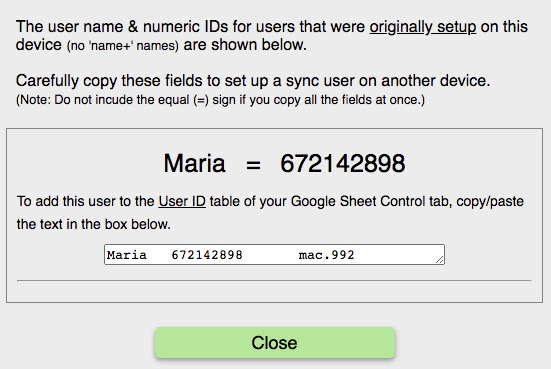

If you did not copy/paste the user information into your sheet (Step 5), do not worry.

You can find the information you need to setup the RightMindMath <b>Iduser</b> sheet using the Setting&#039;s <u>Sync</u> menu.

After clicking the green <u>Sync</u> button, click the <u>Show User IDs set up on this device</u> button.

When you click this button, you will see a dialog like the second image below, but with your child&#039;s information.

