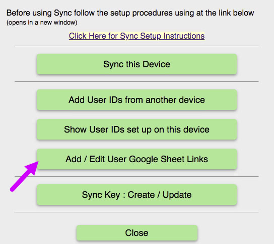
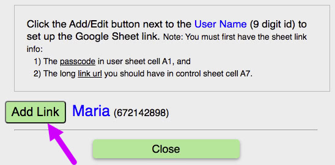
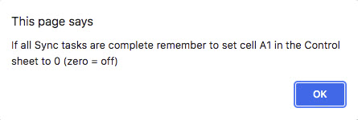
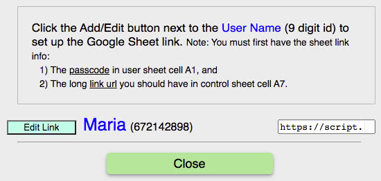

For the next step you must both RMM &amp; your RightMindMath sheet open at the same time.

Step 1

Navigate to the <u>Control</u> sheet in your RightMindMath browser window.

Click into cell <b>A1</b> and change the value to 1 (one) from 0 (zero).

Note: When cell A1 is zero you API is effectively closed. You should only change it to a one when you are doing sync activities.

In the next few steps RMM will check the sync inputs for Maria. So cell A1 needs to be one.

Step 2

Return to RMM and click the <u>Add / Edit User Google Sheet Links</u> button inside the Sync Setting menu.

Step 3

A dialog appears that allows you to click to <u>Add Link</u> for your new user (Maria in this case).

Note: Since this is the first setup for Maria the button is green.

Click the <u>Add Link</u> button.

Step 4

A dialog appears with two text boxes you need to fill from the RightMindMath sheet.

Navigate to the <u>Control</u> sheet of RightMindMath.

Copy the long string value from cell A8 (the sheet URL).

Return to RMM and paste the URL string into the lower text box.

Again navigate to RightMindMath, and open the sheet whose title is equal to your user&#039;s 9-digit <b>Iduser</b>.

Copy the pass code from cell A1.

Return to RMM and paste the pass code into the top text box.

Note: The image below shows the dialog after both text boxes have been filled for Maria.

Click the <u>Save</u> button.

The links inut dialog is replaced by a notification that RMM is testing the link setup.

Step 4

Once the links test is done, you should see the alert message below.

If you get an alert that starts out "Something is wrong with the Google Sheet..." then either the URL string is wrong, or your sheet API is not running. Carefully check the sheet URL. If it is good, then revisit the Topic titled "2) Setup & Run the Sheet API" and repeat the steps for starting the API.

There are also alerts for the device key being wrong/missing, or the value in <u>Control</u> cell <b>A1</b> not being zero. Revisit the appropriate topics to correct these.

If you corrected an error, simply try the <u>Save</u> button again to re-check the links setup.

Step 5

After every process in which RMM talks to your Google Sheet you will get the alert below remining you to lock your API.

In the current case, you have no more Sync tasks so you can navigate to the <u>Control</u> sheet of RightMindMath and set cell <b>A1</b> back to zero.

Your sheet API is once again safely locked.

A new Add/Edit Dialog Look

Since you now have your user links setup, the button and presentaion of the user link info is different

For users with good, active links the <u>Edit Link</u> button is smaller, and blue.

The small text box to the right of the user name has the URL string (it is all there, just not all showing).

