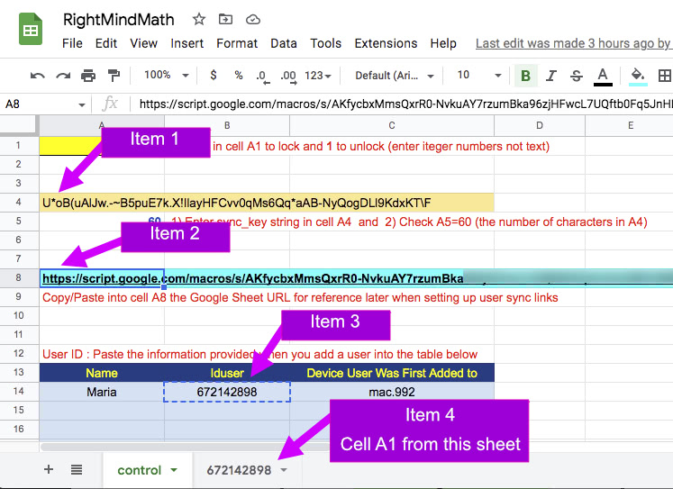

When you install RMM on another device you need access to the information now stored in your RightMindMath Google sheet.

Be sure you have installed RMM as a PWA on the new device before working thru this Topic.

If you can open your Google Sheet on the device, then open it now. You can skip the email suggestion below.

If you cannot open your Google Sheet on the device, then you need to get the information from the sheet to the device.

The easiest way to do this will likely be by copying/pasting the information you need into an email, and send it to an account used on the device

Copy the following fields into the email from your RightMindMath sheet:
<ol>
<li>The 60 character Sync Key (Control sheet cell <b>A4</b>)</li>
<li>The URL String (Control sheet cell <b>A8</b>)</li>
<li>The 9-digit <b>Iduser</b> from the table with user data)</li>
<li>The <b>Pass Code</b> from cell <b>A1</b> in the Iduser sheet</li>
</ol>

The location of these items is shown in the image below

