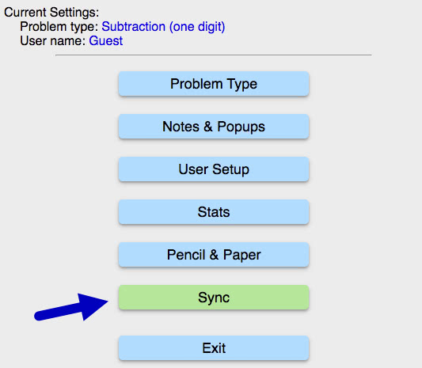
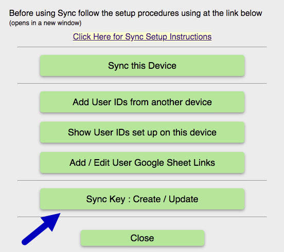
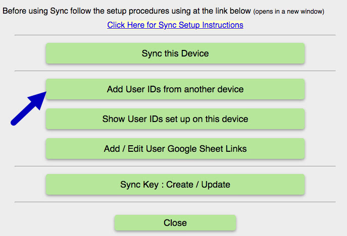

Step 1

After entering a name for the new device you will see the Settings menu.

Click on the green <u>Sync</u> button. Note: all Sync buttons are green. All other buttons are blue.<//span>

Step 2

Click on the green <u>Sync Key : Create / Update</u> button.

Step 3

Copy/paste the existing Sync Key either from the email, or the RightMindMath sheet (Control sheet cell <b>A4</b>).

Click the <u>Update Current Key</u> button after pasting the Sync Key into the <u>New Key</u> (lower) text box.

When you do this, the Sync Key will now show up in the <u>Current Sync Key</u> text box. (The image below shows the result after click the update key).

Click <u>Exit</u> to go back the the Sync Menu.

Step 4

Click the <u>Add User IDs from another device</u> button.

Step 5

Copy/paste the 9-digit Iduser into the lower text box, and type the user name in the upper text box. (Image one below).

Then click the <u>Add</u> button.

After RMM adds the user, you will see an alert saying a "+" was added to the name to mark it as sync-added (versus new) user (second image).

Step 6

You now must Setup the user sheet links for the user you just added (Maria+ in this example).

Rather then repeat this process here, please revisit Topic <u>3) Setup User Sheet Links</u> under the <b>Setup a New Uses</b> section above.

The process is identical except you are likely to copy/paste the information from an email.

<b>IMPORTANT:</b> Remember that your RightMindMath API is likely locked. You cannot setup the user sheet links until you have access to RightMindMath, and are able to toggle cell <b>A1</b> in the <u>Control</u> sheet from zero to one when adding the links, then back to zero when done.

ALSO: Be sure to delete the email with the Google Sheet info. You want to keep this info private.

