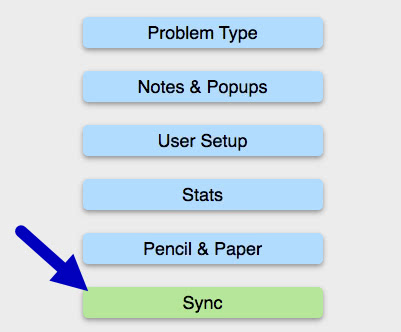
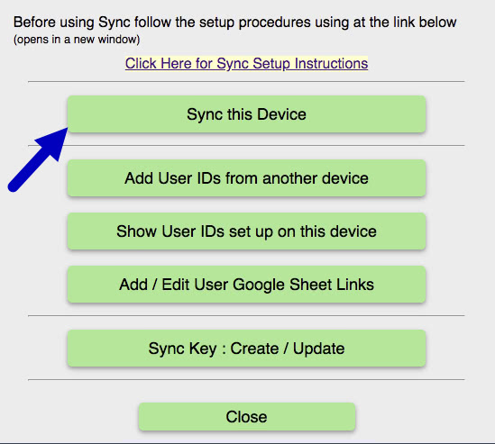
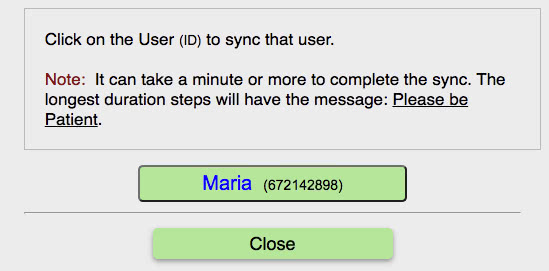

Step 1

Click on the green <u>Sync</u> button. Note: all Sync buttons are green. All other buttons are blue.<//span>

Step 2

Click on the green <u>Sync this Device</u> button.

Step 3

Click on the user name you want to sync.

Note: It takes a few moments for all the uploads &amp; downloads to finsih. You will get an alert when syncing id done.

